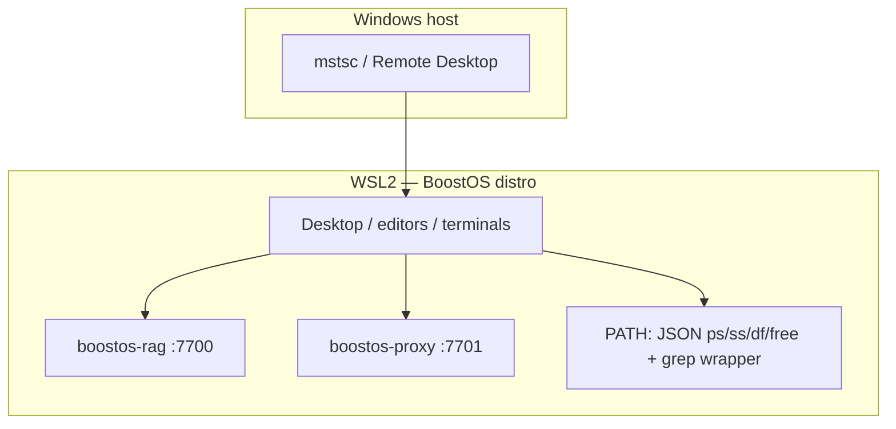

# BoostOS

**One-liner:** A Linux environment built to make AI coding agents more capable — not by replacing your editor or agent, but by giving them **OS-level primitives** they cannot get from an app alone.

---

## What this project is

BoostOS is a **custom Linux environment** (today: WSL2 on Windows, or a Linux VM elsewhere) that you open with remote desktop and use like any other dev machine. You run **the same tools you already use** — Cursor, Claude Code, VS Code, shell agents — inside that environment.

What changes is **underneath**: background services, PATH-level wrappers, and a local API proxy that belong to the OS, not to any single product. Those pieces give agents capabilities that are awkward or impossible when every tool only sees one workspace at a time.

**What BoostOS is not:** A replacement for Cursor, Claude Code, or any coding tool. It does not pick your stack. It **augments** whatever you run on top.

---

## The idea

Coding agents are excellent **inside a project**: read files, run tests, call APIs. They are weak at things that require **a view across the whole machine** — every repo on disk, consistent usage accounting, fast search over huge trees, structured facts about processes and ports without brittle parsing.

That gap exists because editors and agents are **applications**. They sit above the OS; they do not own the file system, the process table, or the network stack. BoostOS is the opposite bet: **put the agent on an OS that was built to expose those primitives on purpose.**

The design rule is simple: **every feature here is something only an OS can do well** — or that is dramatically cleaner at OS scope than as a plugin in every editor. Agents inherit those capabilities through the environment (services on localhost, wrappers on `PATH`, env vars for API routing), not through one-off configuration per tool.

---

## How BoostOS helps (including “making stuff faster”)

### Find the right code faster

- **Semantic search across projects** — Your IDE searches one workspace. BoostOS runs a **RAG daemon** that indexes watched trees and answers natural-language queries (`boostos-search`, HTTP API on port **7700**). That cuts down blind file-by-file exploration and repeated “search the whole disk” sessions agents sometimes fall into.
- **Faster recursive grep** — A **trigram index** sits beside the vector index. For literal patterns over big directories, the wrapper narrows which files need a real `grep` pass — often **shrinking the search space by a large margin** before correctness-preserving grep runs. Wrong answers are not traded for speed: when the index cannot help, it falls back to stock `grep` transparently.

### Spend fewer tokens and less wall-clock on “plumbing”

- **JSON-first system commands** — `ps`, `ss`, `df`, and `free` can emit **compact JSON** by default so agents do not burn context parsing columns and headers. Smaller, structured output means **less noise per tool call** and fewer mistaken reads of padded text.
- **Streaming-safe API proxy** — A local proxy on **7701** records usage from provider responses so **`boostos-stats`** can show tokens and cost without re-tokenizing streams. Sessions point `ANTHROPIC_BASE_URL` / `OPENAI_BASE_URL` at it so SDKs pick it up **without per-tool setup**.

### Room to grow: coordination and isolation

The repo also tracks **agent registry**, **feature flags**, a **debug panel**, and a **FUSE-style overlay** for parallel work on one tree — see [vision.md](vision.md) for the full picture and roadmap.

---

## Implemented capabilities (summary)

| Layer | Role |
|--------|------|
| **Desktop** | Full Linux session over RDP from Windows (WSL2); run your usual editors inside BoostOS. |
| **RAG daemon (:7700)** | Offline semantic search, watch lists, JSON/`jq`-friendly CLI and HTTP API. |
| **Trigram-backed `grep`** | Prune then verify — faster large-tree literal search when the index applies. |
| **JSON `ps` / `ss` / `df` / `free`** | Structured defaults; `--raw` for native binaries. |
| **API proxy (:7701)** | Usage and cost visibility via `boostos-stats`. |
| **Agents & debug** | Registry, tool history, toggles — details in [vision.md](vision.md). |

---

## Architecture



---

## Quick start (Windows + WSL2)

**Prerequisites:** Windows 11 (or 10) with WSL2 enabled, PowerShell, and permission to install a distro.

1. Clone this repository on the Windows side.
2. From an **elevated** PowerShell session at the repo root:

   ```powershell
   Set-Location path\to\BoostOS
   .\scripts\windows\install-boostos.ps1
   ```

   Defaults: distro name `BoostOS`, user `boost`, RDP port `3390`.

3. Connect:

   ```powershell
   .\scripts\windows\connect-boostos.ps1 -OpenMstsc
   ```

   Session modes include `xfce`, `minimal`, and `niri` (see the script).

4. For RAG, proxy, and agent features after guest provisioning, follow [docs/phase2-rag-daemon.md](docs/phase2-rag-daemon.md) and [vision.md](vision.md).

**Other platforms:** Same idea in a Linux VM with RDP; scripts here are Windows-first today.

---

## Repository layout

| Path | Role |
|------|------|
| [`scripts/windows/`](scripts/windows/) | Install, connect, RDP helpers. |
| [`scripts/linux/`](scripts/linux/) | Guest provisioning. |
| [`config/`](config/) | XRDP, systemd, niri, Claude defaults, RAG samples. |
| [`src/`](src/) | Python `boostos_rag`; Rust `boostos_fuse`. |
| [`docs/`](docs/) | Phases, editor setup, validation. |
| [`vision.md`](vision.md) | Full spec: APIs, CLI, roadmap. |

---

## Documentation

| Doc | Contents |
|-----|----------|
| [vision.md](vision.md) | Complete feature description, HTTP APIs, CLI, roadmap. |
| [docs/phase1-foundation.md](docs/phase1-foundation.md) | Desktop + RDP foundation. |
| [docs/phase2-rag-daemon.md](docs/phase2-rag-daemon.md) | RAG service and indexing. |
| [docs/editor-setup.md](docs/editor-setup.md) | Cursor / VS Code in the guest. |
| [docs/validation-checklist.md](docs/validation-checklist.md) | Session validation. |
| [docs/tool-storage-research.md](docs/tool-storage-research.md) | Design notes. |

---

## Developing the Python package

```bash
cd src
pip install -e .
```

Entry points: [`src/pyproject.toml`](src/pyproject.toml) (`boostos-search`, `boostos-rag`, `boostos-proxy`, `boostos-stats`, `boostos-agent`, `boostos-feature`).

---

## License

This project is licensed under the MIT License — see [LICENSE](LICENSE).
